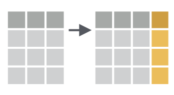
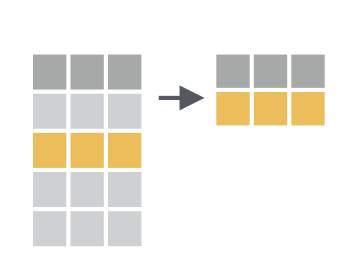

```{r setup, include=FALSE}
knitr::opts_chunk$set(echo = TRUE)
```

# Loading Packages

Load the `tidyverse` package. 

```{r}
library(tidyverse)
```

# Import chds6162_data 


```{r}
data <- read_csv("data/chds6162_data.csv")

```

# select


With the function `select` we can select variables (columns) from the larger data frame. 

Use `select` to show just the `gestation` variable.

```{r}
data_ges <- data %>%
  select(gestation)
```

We can also `select` a range of columns. `select` all the variables that belong to the father (they had a "d" in front of them) `drace` to `dwt`.

```{r}
data %>%
  select(drace:dwt)

#What about just the id column and everything after the father information?
data %>%
  select(id, marital:last_col())
```

We can drop variables using the -var format. Drop the `marital` variable.
```{r}
data %>%
  select(-(marital))
```


# mutate




We use `mutate` we make new variables or change existing ones. 

Create a **new variable with a specific value**

Create a new variable called `data_decade`. Imagine that you will be merging this dataset from 61-62 to dataset from the 70's. To make it easier, you will create this variable with the value "60s."

```{r}
data %>%
  mutate(data_decade = "60s")
```


Create a **new variable based on other variables**

Create a new variable called `wt_k`. This variable will give you information about mom's weight pre-pregnancy(`wt`) in kilos (1 pound = .454 kilos).

```{r}
data %>% 
  mutate(wt_k = wt*.454)

# too many decimals? let's round things

data %>% 
  mutate(wt_k = round((wt*.454),2))

```
# case_when


Change an **existing variable**

For some reason you want to have the real labels rather than the values. Let's change the `marital`variable to its real values: 1 = married, 2 = legally separated, 3 = divorced, 4 = widowed, 5 = never married. 

```{r}
data %>% 
  mutate(marital = case_when(
    marital == 1 ~ "married",
    marital == 2 ~ "legally separated",
    marital == 3 ~ "divorced",
    marital == 4 ~ "widowed",
    marital == 5 ~ "never married"
  ))
```

# filter



art by @allison_horst

We use `filter` to choose a subset of cases.

Use `filter` to keep only those whose parents have been never married (value `5` in the `marital` variable. Then, use `select` to show only the `age` variable to let us explore the mothers' ages when they delivered. 

```{r}
data %>%
  filter(marital == 5) %>%
  select(age)

```

Use `filter` to keep only those who are **not** divorced (value `3`).

```{r}
data %>%
  filter(marital != 3)
```


Use `%in%` within the `filter` function to keep only those who are divorced (3), legally separated (2), or widowed (4).

```{r}
data %>%
  filter(marital %in% c(2, 3,4))
```

Create a chain that keeps only those whose moms were in their 20s when they delivered and are college grads (val= 5). Use the `age` and `ed` variables.

```{r}
data %>%
  filter(ed == 5, age %in% 20:30)

```

We can use `<`, `>`, `<=`, and `>=` for numeric data. == equal, != not equal 

# summarize or summarise


With `summarize`,as the name implies, you will get a summary of your dataset.

Get the mean days of gestation for this sample.

```{r}
data %>%
  summarize(gestation_length_mean = round(mean(gestation, na.rm = TRUE),2))
```

We can have multiple arguments in each usage of `summarize`.

In addition to the mean gestation length you calculated earlier, calculate the minimum and maximum for the same variable.

```{r}
data %>%
  summarize(mean_gestation_length = mean(gestation, na.rm = TRUE),
            min_gestation_length = min(gestation, na.rm = TRUE),
            max_gestation_length = max(gestation, na.rm = TRUE))
```

# group_by


`group_by`enables us to perform calculations on each of our groups. 

Calculate the mean gestation length in days based on mother's smoking habits (0=never, 1=smokes now, 2=until current pregnancy, 3=once did, not now) using `group_by` and `summarize`.

```{r}
data %>% 
  group_by(smoke) %>%
  summarize(mean_gestation_length = mean(gestation,
                                    na.rm = TRUE))

#Since we know that there are some NAs in the Smoke variable we can go ahead and drop those NAs before we summarize them
data %>% 
  drop_na(smoke) %>%
  group_by(smoke,ed) %>%
  summarize(mean_gestation_length = mean(gestation,
                                    na.rm = TRUE))
```

We can use `group_by` with multiple groups.


# across


`across`enables us to perform calculations on each of our selected columns 

In the example above, we calculated the mean for gestation but what about if I wanted the mean for gestation, mom age (age) and dad age (dage)

```{r}

#If we didn't know better, we would do this:
data %>% 
  drop_na(smoke) %>%
  group_by(smoke) %>%
  summarize(mean_gestation_length = mean(gestation,
                                    na.rm = TRUE),
            mean_m_age = mean(age,
                                    na.rm = TRUE),
            mean_d_age = mean(dage,
                                    na.rm = TRUE))
```


```{r}

#But we know better:
data %>% 
  drop_na(smoke) %>%
  group_by(smoke) %>%
  summarize(across(c(gestation,age,dage),mean,na.rm = TRUE))

?across
```


# Create a new data frame

Sometimes you want to save the results of your work to a new data frame or replace the one you already have (not recommended). 

```{r}
to_graph <- data %>% 
  drop_na(smoke) %>%
  group_by(smoke) %>%
  summarize(across(c(gestation,age,dage),mean,na.rm = TRUE))
```

# relocate


Sometimes you want to export the table as a csv but you don't really like the order of the columns. Relocate allows you to move them around without you having to go back to previous codes. Let's take the `to_graph` data frame and move the age column before the gestation column. 

```{r}
?relocate

to_graph %>%
  relocate (age, .before = gestation)


#What if I wanted gestation to be the last column?
to_graph %>%
  relocate (gestation, .after = last_col())

# ok now I like it and want a CSV of it. 
# I make sure to save it as a dataframe and then export it
csv_to_export <- to_graph %>%
  relocate (gestation, .after = last_col())

# export csv
write_csv(csv_to_export, "exports/example_to_export.csv")
```


