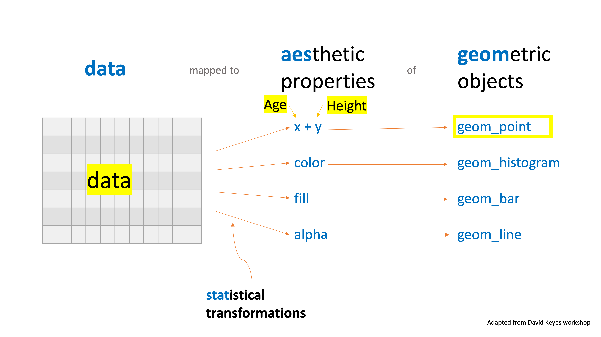
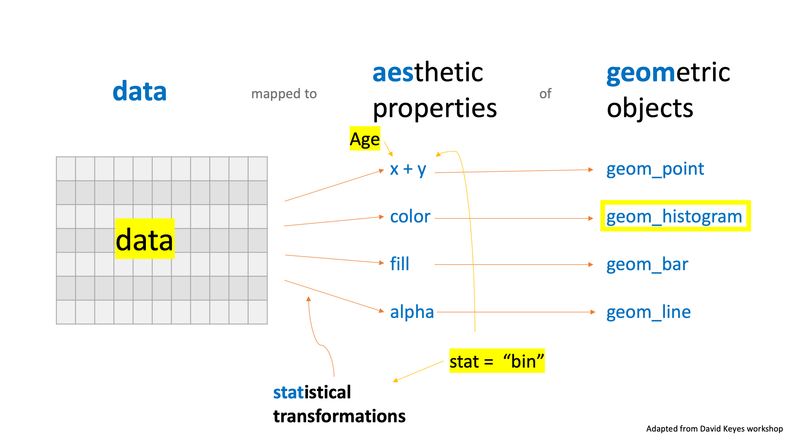
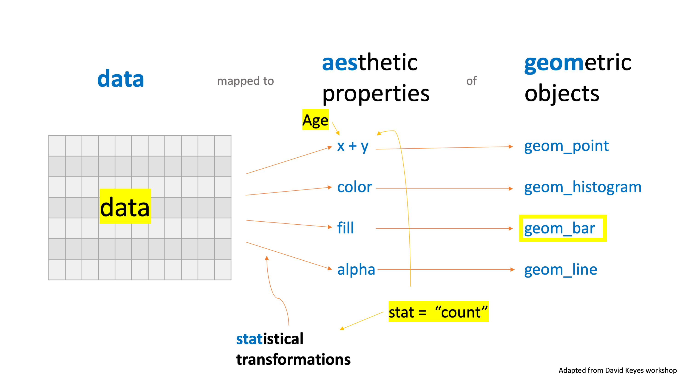

```{r setup, include=FALSE}
knitr::opts_chunk$set(echo = TRUE)
```


# Load Packages

Let's load the `tidyverse` package. 

```{r}
library(ggplot2)
library(tidyverse)
```

# Import chds6162_data Data

Let's import our data using `read_csv`. 

```{r}
data <- read.csv("data/chds6162_data.csv")
```

# ggplot template

```{r eval = FALSE}
ggplot(data = data_frame,
       mapping = aes(x = x_variable,
                     y = y_variable)) +
  geom_something()
```


# Scatterplot

We use `geom_point` to make a scatterplot. Let's make a scatterplot that shows age on the x axis and height on the y axis.

```{r}
ggplot(data = data,
       mapping = aes(x = age,
                     y = ht)) +
  geom_point()

#another way you may see this

ggplot(data,aes(age,ht)) + geom_point()
```




# Histogram 

We use `geom_histogram` to make a histogram. Let's make a histogram of age.

```{r}
ggplot(data = data, 
       mapping = aes(x = age)) +
  geom_histogram()
```


How does ggplot know what to plot on the y axis? It's using the default statistical transformation for `geom_histogram`, which is `stat = "bin"`.




If we add `stat = "bin"` we get the same thing. Each geom has a default stat.

```{r}
ggplot(data = data, 
       mapping = aes(x = age)) +
  geom_histogram(stat = "bin")

#shorter way to do write it:

ggplot(data,aes(age)) + geom_histogram()
```

We can adjust the number of bins using the `bins` argument. 

```{r}
ggplot(data = data, 
       mapping = aes(x = age)) +
  geom_histogram(bins = 10)
```


# Bar Chart

There are two basic approaches to making bar charts, both of which use `geom_bar`.

**Approach #1**

Use your full dataset.

Only assign a variable to the x axis.

Let ggplot use the default `stat` transformation (`stat = "count"`) to generate counts that it then plots on the y axis.

**Approach #2**

Wrangle your data frame before plotting, possibly creating a new data frame in the process

Assign variables to the x and y axes

Use `stat = "identity"` to tell ggplot to use the data exactly as it is


## Bar Chart v1

Let's make a bar chart that shows height.


```{r}
ggplot(data = data, 
       mapping = aes(x = age)) +
  geom_bar()
```


The default statistical transformation for `geom_bar` is `count`. This will give us the same result as our previous plot for histograms.

```{r}
ggplot(data = data, 
       mapping = aes(x = age)) +
  geom_bar(stat = "count") 


#or
ggplot(data, aes(age)) + geom_bar() 
```

Here's what's going on.




## Bar Chart v2

It's often easier to do our analysis work, save a data frame, and then use this to plot.

Let'create a dataframe of gestation lenght (this time in weeks) by mother smoking habits.

```{r}
gestation_by_smoke <- data %>% 
  mutate(gestation_w = gestation/7,
         smoke = case_when(
    smoke == 1 ~ "smokes now",
    smoke == 2 ~ "until now",
    smoke == 3 ~ "once did",
    smoke == 0 ~ "never")) %>% 
  group_by(smoke) %>% 
  summarize(gestation_w = mean(gestation_w,na.rm = TRUE)) %>%
  drop_na(smoke)
```

Then let's use this data frame to make a bar chart. The `stat = "identity"` here tells ggplot to use the exact data points without any `stat` transformations.

```{r}
ggplot(data = gestation_by_smoke, 
       mapping = aes(x = smoke, 
                     y = gestation_w)) +
  geom_bar(stat = "identity") 
```


# `color` and `fill`

## color

We add the color argument *within* the `aes` so that the data in that variable is mapped to those aesthetic properties. 

Let's add different colors for males and males to our previous scatterplot.

```{r}

data <- data %>% 
  mutate(smoke_lbl = case_when(
    smoke == 1 ~ "smokes now",
    smoke == 2 ~ "until now",
    smoke == 3 ~ "once did",
    marital == 0 ~ "never"))

ggplot(data = data,
       mapping = aes(x = age,
                     y = ht,
                     color = smoke_lbl)) + 
  geom_point()

#what if our "color"variable is continues rather than labels

ggplot(data,aes(age,ht,color = smoke)) + geom_point()
```


Let's try the same thing with our last bar chart (gestation_by_smoke. 

```{r}
ggplot(data = gestation_by_smoke, 
       mapping = aes(x = smoke, 
                     y = gestation_w,
                     color = smoke)) +
  geom_bar(stat = "identity") 
```

That didn't work! Let's try `fill` instead.

```{r}
ggplot(data = gestation_by_smoke, 
       mapping = aes(x = smoke, 
                     y = gestation_w,
                     fill = smoke)) +
  geom_bar(stat = "identity")
```


# Scales

## color

We can change which colors the data is mapped to by using a `scale_` function. 

Let's use a built-in palette like `scale_color_viridis_d` (d = discrete data).*

*FYI: The viridis scales provide colour maps that are perceptually uniform in both colour and black-and-white. They are also designed to be perceived by viewers with common forms of colour blindness. The package contains 4 color scales: viridis, magma, plasma, and infermo.

```{r}
ggplot(data = data,
       mapping = aes(x = age,
                     y = ht,
                     color = smoke_lbl)) + 
  geom_point() +
  scale_color_viridis_d(option = "plasma")

# shorter version
ggplot(data,mapping = aes(age,ht,color = smoke_lbl)) + geom_point() + scale_color_viridis_d(option = "plasma")
```


# Plot Labels

To add labels to our plot, we use `labs`. let's add a `title` argument to the last scatterplot.

```{r}
ggplot(data,mapping = aes(age,ht,color = smoke_lbl)) +
  geom_point() + 
  scale_color_viridis_d(option = "plasma") + 
  labs(title = "Mother's age and height by smoking habits")
```

We can add a `subtitle` as well.

```{r}
ggplot(data,mapping = aes(age,ht,color = smoke_lbl)) + 
  geom_point() + scale_color_viridis_d(option = "plasma") + 
  labs(title = "Mother's age and height by smoking habits", 
       subtitle = "Data from the Child Health and Development Studies 1961 and 1962")
```


We can change the x and y axis labels using the `x` and `y` arguments.

```{r}
ggplot(data,mapping = aes(age,ht,color = smoke_lbl)) + 
  geom_point() + scale_color_viridis_d(option = "plasma") + 
  labs(title = "Mother's age and height by smoking habits", 
       subtitle = "Data from the Child Health and Development Studies 1961 and 1962", 
       x = "Age",
       y = "Height (inches)", 
       color = "Smoking habits")
```


# Themes

To add a theme to a plot, we use the `theme_` set of functions. There are several built-in themes. For instance, `theme_minimal`.

```{r}
ggplot(data,mapping = aes(age,ht,color = smoke_lbl)) + 
  geom_point() + 
  scale_color_viridis_d(option = "plasma") + 
  labs(title = "Mother's age and height by smoking habits", 
       subtitle = "Data from the Child Health and Development Studies 1961 and 1962", 
       x = "Age",
       y = "Height (inches)", color = "Smoking habits") + 
  theme_minimal()
```

There are also packages that give you themes you can apply to your plots. 

`ggthemes` package

```{r}
library(ggthemes)
?ggthemes
```

We can then use a theme from this package (`theme_excel_new`) to make our plots look like those in the new version of Excel.

```{r}
ggplot(data,mapping = aes(age,ht,color = smoke_lbl)) + 
  geom_point() + scale_color_viridis_d(option = "plasma") + 
  labs(title = "Mother's age and height by smoking habits", 
       subtitle = "Data from the Child Health and Development Studies 1961 and 1962", 
       x = "Age",
       y = "Height (inches)", 
       color = "Smoking habits") + 
  theme_excel_new()


#what about APA?
library(jtools)

ggplot(data,mapping = aes(age,ht,color = smoke_lbl)) + 
  geom_point() + scale_color_viridis_d(option = "plasma") + 
  labs(title = "Mother's age and height by smoking habits", 
       subtitle = "Data from the Child Health and Development Studies 1961 and 1962", 
       x = "Age",
       y = "Height (inches)", 
       color = "Smoking habits") + 
  theme_apa() 
```


# Facets (my favorite feature when making graphs)

You can make small multiples by adding just a line of code using the `facet_wrap` function. Let's make separate plot for all the labels in the smoking variable

```{r}
ggplot(data,mapping = aes(age,ht,color = smoke_lbl)) + 
  geom_point() + scale_color_viridis_d(option = "plasma") + 
  labs(title = "Mother's age and height by smoking habits", 
       subtitle = "Data from the Child Health and Development Studies 1961 and 1962", 
       x = "Age",
       y = "Height (inches)", 
       color = "Smoking habits") + 
  theme_apa() + 
  facet_wrap(~smoke_lbl)
```


We can do this for any type of figure. let's make multiple histograms for age by smoking habits


```{r}
ggplot(data = data, 
       mapping = aes(x = age)) +
  geom_histogram() +
   theme_apa() + 
  facet_wrap(~smoke_lbl) 
```

Another example:

```{r}
ggplot(data = data,
       mapping = aes(x = age,
                     y = ht,
                     color = smoke_lbl)) + 
  geom_point() +
  scale_color_viridis_d(option = "magma") +
  labs(title = "Association Between Age and Height",
       subtitle = "Data from the Child Health and Development Studies 1961 and 1962",
       x = "Age",
       y = "Height (inches)",
       color = "Smoking Habits") +
  theme_economist() +
  facet_wrap(~ed)
```

# Save Plots

RMarkdown: just knit your file and your plots will show up as part of your HTML, Word, or PDF document.

just by itself: use the `ggsave` function. By default, `ggsave` will save the last plot you made.So you can add it to each of the graphs you want to save.

```{r}
ggplot(data,mapping = aes(age,ht,color = smoke_lbl)) + 
  geom_point() + scale_color_viridis_d(option = "plasma") + 
  labs(title = "Mother's age and height by smoking habits", 
       subtitle = "Data from the Child Health and Development Studies 1961 and 1962", 
       x = "Age",
       y = "Height (inches)", 
       color = "Smoking habits") + 
  theme_apa() + 
  facet_wrap(~smoke_lbl)

ggsave("plots/plot_example.png")
```

```

We can save our plot to other formats as well. PDF is a great option.

```{r}
ggsave("plots/example.pdf")
```


