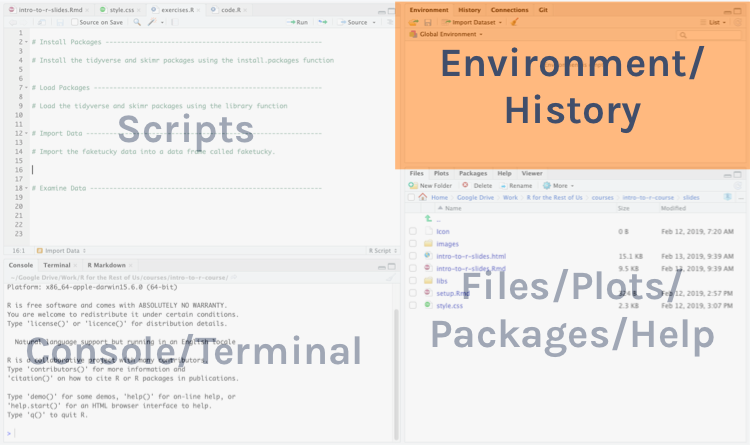

```{r child = "setup.Rmd"}
```

```{r packages, include = F, eval = T}
library(tidyverse)
library(skimr)
library(janitor)
library(DT)
library(here)
library(kableExtra)
library(knitr)
```

class: center, middle, inverse, dk-section-title

**Slides adapted from David Keyes (@dgkeyes), inspired by Danielle Navarro (@djnavarro) and Paul Campbell (@paulcampbell91)**

---
class: center, middle, inverse, dk-section-title

# Agenda

Logistics

--

Intro to R and Importing Datasets

--

 RMarkdown

--

_**Break**_

--

Data Manipulation

--

Data Visualization

---

class: center, middle, inverse, dk-section-title

# Logistics


---

## Zoom Emojis

.pull-left[
<div class="sticky-good">
I'm good
</div>


]

.pull-right[
<div class="sticky-stuck">
I'm stuck
</div>


]

---

## Stuck? Ask your partner

--

.center[
]

---

## Stuck? Ask your partner


.center[
]

---

class: center, middle, inverse, dk-section-title

# Intro to R and Importing Datasets


---

### Tour of RStudio

.center[

]

---


## File Types

There are **two main file types** that you'll work with: 

.pull-left[
**R scripts (.R)**

Text is assumed to be executable R code unless you comment it (more on this soon)

```{r}

# This is a comment

data <- read_csv("data.csv")

```
]
--

.pull-right[
**RMarkdown files (.Rmd)**

Text is assumed to be text unless you put it in a code chunk (more on this soon)]
---

## R Scripts


Create new script file: File -> New File -> R Script


---


## How to Run Code

Run the code: 

--

* control + enter on Windows  

--

* command + enter on Mac keystrokes or use Run button
---

## Comments

Do them for others and for your future self! 

```{r eval = F}

# Show the first 5 rows of my data

head(data, n = 5)

```


---
## Install Packages

The syntax to install packages is as follows: 

```{r eval=F}
install.packages("tidyverse")
install.packages("skimr")
```

The package name must be in quotation marks.

--

.dk-highlight-box[
Packages should be installed **once per computer**.
]

---

## Load Packages

To load packages, use the following syntax:

```{r eval = T}
library(tidyverse)
library(skimr)
```

--

.dk-highlight-box[
Packages should be loaded **once per session**. 
]

---

## Import Data

### CSV

```{r eval = F}

chds6162_data <- read_csv(here("data", "chds6162_data.csv"))

chds6162_data <- read_csv("data/chds6162_data.csv")

```

---

### Excel
```{r eval = F}
library(readxl)

chds6162_data <- read_excel("data/chds6162_data.xls")

```

--

### SPSS
```{r = FALSE}
library(haven)
chds6162_data <- read_sav("data/chds6162_data.sav")

```


---


## R is Case Sensitive

R is **case sensitive** so choose one of the following for all objects and **be consistent**.
.pull-left[
**Option**

snake_case 

camelCase

periods.in.names
]

--

.pull-right[

**Example**

student_data

studentData

student.data
]

---
Art by @allison_horst


---


## Directories

If the data file is in the working directory, you only need to specify its name.

```{r}
chds6162_data <- read_csv("chds6162_data.csv")
```

--

If the data file is not in the working directory, you need to specify the full path name.

```{r echo=TRUE}
chds6162_data <- read_csv("data/chds6162_data.csv")
```

--

.dk-highlight-box[
*Using an RStudio project sets your working directory to the folder where your project lives so you only need to specify the location relative to that*
]

---

## Where Does Our Dataset Live?

Data we have imported is available in the environment/history pane.

.center[

]


---


### ?function

Use the ? to get help about anything you're confused about

```{r}

?read_csv

```


