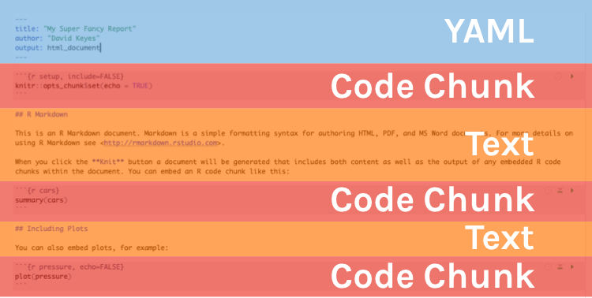
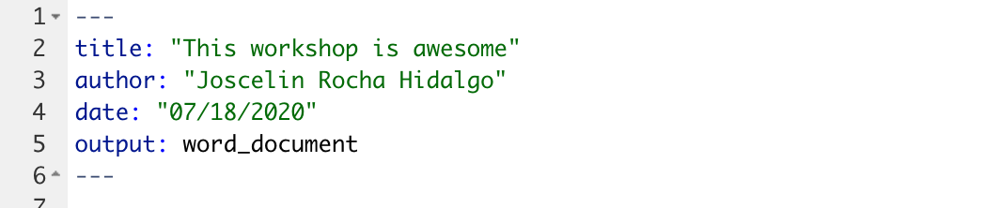
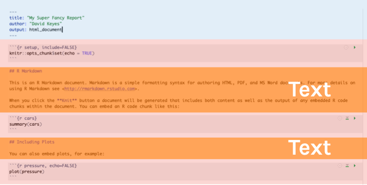
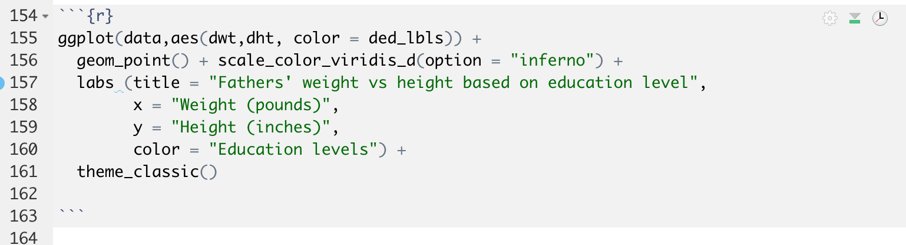
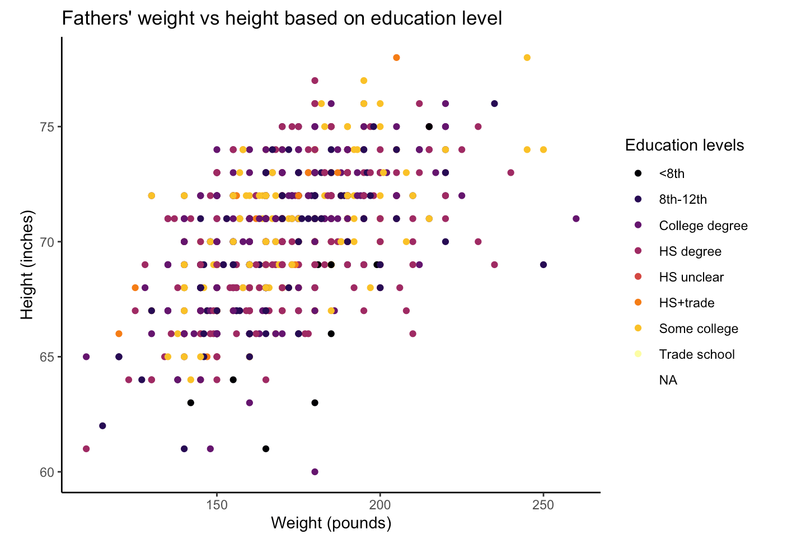
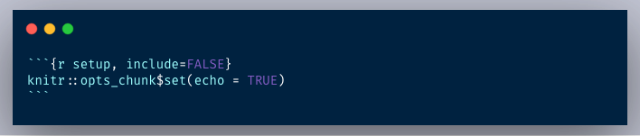

```{r include = FALSE}
#options(htmltools.dir.version = FALSE)
#xaringan::inf_mr()
```

class: center, middle, inverse, dk-section-title

**Slides adapted from David Keyes (@dgkeyes), inspired by Danielle Navarro (@djnavarro) and Paul Campbell (@paulcampbell91)**

---

Art by @allison_horst


---
# RMarkdown Overview

--

Every RMarkdown document has the following:



---
## Knitting (aka Export)


---

# YAML



--
Stands for "YAML Ain't Markup Language"

--

Where you add title, author, date, output options, etc. 

--

---


# Text




---

## Text


.pull-left[
**Markdown**

```
Text with **some words in bold** 
and *some words in italics*


```

]

--

.pull-right[
**Output**

Text with **some words in bold** and *some words in italics*

]


---

## Headers


.pull-left[
**Markdown**

```


# First-Level Header

## Second-Level Header

### Third-Level Subheader


```
]

--

.pull-right[
**Output**

# First-Level Header

## Second-Level Header

### Third-Level Subheader

]


---


## Lists


.pull-left[
**Markdown**

```

- Bulleted list item
- Bulleted list item


1. Numbered list item
1. Numbered list item
```
]

--

.pull-right[
**Output**


- Bulleted list item #1
- Bulleted list item #2


1. Numbered list item #1
1. Numbered list item #2

]


---

class: inverse

## Your Turn


1. Create a new RMarkdown file, setting the default output format as Word.

1. Save your RMarkdown file as report.Rmd.

1. Go into the YAML and change the title to “My 2020 Report.”

1. Change the output format to HTML by changing `output: word_document` to `output: html_document`.

1. Add the following first-level header: "Introduction"

---
class: inverse

## Your Turn

<ol start=6>
<li> Add this text (note the bold and italics) below the introduction header: "My name is (write your name here). I am the most **amazing** human being. You've *never* met someone like me. Please hire me!"    

<li> Add the following second-level header: "Reasons Why I am the Best"

<li> Add the following list of reasons:

    - Because I say so
    - Because it is true
    - Why would I lie?

<li> Knit and reopen the report.html file to make sure your changes show up.

---

# Code Chunk


They start with three backticks and {r} and end with three backticks. 

.pull-left[



]

--

.pull-right[


]


---

## Insert a Code Chunk: Button


---

## Insert a Code Chunk: Keyboard Shortcut


.pull-left[


**Windows**

*control+alt+i*     


]

--
.pull-right[


**Mac**

*command+option+i*
]                                           
                                               
---

## Chunk Options

**Other options** that we won't discuss today:

- **`warning`** (show any warnings that R throws)
- **`message`** (show any messages that R sends)
- **`fig.width`** (default figure width)
- **`fig.height`** (default figure height)
- **`echo`** (show the R code in the knitted report)
- and many more ...


---


## Setup Code Chunk

--

A special code chunk with the text `setup` right after the `r`. 



--

All chunk options can be set at the **global level** (in the setup code chunk) or at the **chunk level** (for individual chunks).

--

Options at the individual chunk level **override** global chunk options.
