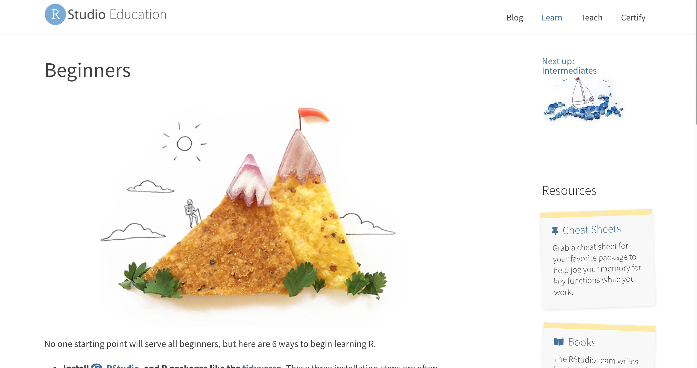

```{r include = FALSE}
#options(htmltools.dir.version = FALSE)
#xaringan::inf_mr()
```

class: inverse, center, middle, dk-section-title

# Twitter

---

.pull-left[
Here are a couple of wonderful accounts you could follow:   
- [@rstatstweet](https://twitter.com/rstatstweet?lang=en)
- [@tidyversetweets](https://twitter.com/tidyversetweets)
- [@R_Forwards](https://twitter.com/R_Forwards)
- [@djnavarro](https://twitter.com/djnavarro)
- [@hadleywickham](https://twitter.com/hadleywickham)
- [@allison_horst](https://twitter.com/allison_horst)
- [@thomasp85](https://twitter.com/thomasp85)
- [@R_LGBTQ](https://twitter.com/R_LGBTQ)
- [@RLadiesDC](https://twitter.com/RLadiesDC)
- [@rctatman](https://twitter.com/rctatman)
- [@RLadiesGlobal](https://twitter.com/RLadiesGlobal)
- and many many more!
]


.pull-right[

  art by @allison_horst
]

---
class: inverse, center, middle, dk-section-title

# Resources

---

## Where can I get resources?


.pull-left[
You can start by visiting my [GitHub wiki site](https://github.com/Joscelinrocha/Learning-R-resources/wiki).


]

.pull-right[
You can visit the [Rstudio Education site](https://education.rstudio.com/learn/beginner/): https://education.rstudio.com/learn/beginner/ 


]


---

class: inverse, center, middle, dk-section-title

# Have Fun!

---

.pull-left[It may be frustrating at first but it gets better 😅!

art by @allison_horst]

--

.pull-right[
Remember that there is an entire community happy to help you out whenever you encounter an obstacle in your learning path! 
          
          

art by @allison_horst]


